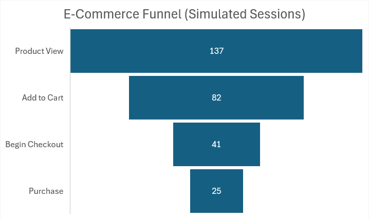

# 🛒 SQL E-Commerce Funnel & Revenue Analysis

This project simulates and analyzes user behavior across a four-step e-commerce funnel to identify conversion bottlenecks and quantify revenue optimization opportunities.

Using T-SQL, the analysis models user progression from product view to purchase, calculates step-level conversion rates, and estimates potential revenue uplift from targeted funnel improvements.

The analysis evaluates user sessions across the following stages:

1. `product_view`  
2. `add_to_cart`  
3. `begin_checkout`  
4. `purchase`  

---

# 🎯 Business Objective

The goal of this analysis is to:

- Measure step-to-step conversion rates  
- Identify where users drop off in the funnel  
- Determine top-performing products by revenue  
- Quantify potential revenue uplift from conversion improvements  
- Provide actionable business recommendations  

---

# 🧠 Executive Summary

This analysis evaluated **137 simulated user sessions** across a four-step e-commerce funnel.

## 📊 Funnel Performance

| Stage | Users | Conversion Rate |
|-------|-------|----------------|
| Views | 137 | — |
| Add to Cart | 82 | 59.85% |
| Begin Checkout | 41 | 50.00% (from cart) |
| Purchase | 25 | 60.98% (from checkout) |
| **Overall View → Purchase** | — | **18.25%** |

### 🔎 Key Insight

The largest drop-off occurs between **Cart → Checkout (50%)**.

This indicates friction before payment begins, making cart abandonment the primary optimization opportunity.

---

# 💰 Revenue Analysis

Top revenue-generating products:

1. **Smartwatch** – $999.95  
2. **Noise Cancelling Headphones** – $259.98  
3. **LED Desk Lamp** – $199.95  

High-value electronics drive the majority of revenue.

Improving checkout initiation rates for premium products would significantly increase total revenue.

---

# 📈 Revenue Optimization Scenario

A simulated 5% improvement in checkout completion demonstrates measurable projected revenue growth, particularly for high-ticket electronics such as Smartwatches and Headphones.

This highlights how small improvements at critical funnel stages can materially impact overall revenue.

This demonstrates how small conversion gains at critical funnel stages can materially impact revenue.

---

# 🧩 Technical Approach

The analysis was performed using T-SQL and structured in multiple stages:

### 1️⃣ Data Generation
- Simulated 137 user sessions  
- Randomized product interactions  
- Realistic drop-off behavior between funnel steps  

### 2️⃣ Funnel Modeling
- Used CTEs to construct user-level funnel progression  
- Applied `MAX(CASE WHEN ...)` logic to track step completion  
- Calculated step-to-step and overall conversion rates  
- Used `NULLIF()` to safely prevent division errors  

### 3️⃣ Product-Level Analysis
- Aggregated conversion metrics by product  
- Joined product metadata (category, price)  
- Calculated revenue per product  

### 4️⃣ Uplift Modeling
- Estimated projected revenue from a +5% checkout improvement  
- Modeled incremental revenue impact  

---

# 🛠 SQL Concepts Demonstrated

- Common Table Expressions (CTEs)  
- Aggregations (`SUM`, `COUNT`)  
- Conditional logic (`CASE WHEN`)  
- Step-to-step conversion calculations  
- Revenue modeling  
- Join operations  
- NULL-safe division using `NULLIF`  
- Structured query design for analytical reporting  

---

# 📷 Sample Output

## 🔻 Funnel Snapshot (137 Sessions)

```
Product View      137  (100%)
Add to Cart        82  (59.85%)
Begin Checkout     41  (50.00% of cart)
Purchase           25  (60.98% of checkout)
Overall CVR             18.25%
```

### Funnel Visualization


Additional outputs included:
- Product-level revenue breakdown  
- Checkout-to-purchase conversion analysis  
- 5% revenue uplift projection model  

---

# 🎯 Strategic Recommendations

Based on the analysis:

- Reduce friction between cart and checkout (guest checkout, fewer required fields)  
- Implement cart abandonment email/SMS campaigns  
- A/B test checkout entry flow  
- Offer limited-time incentives on high-value electronics  
- Analyze checkout UX for unnecessary steps  

---

# 💼 Portfolio Positioning

This project demonstrates the ability to:

- Translate raw event data into business insights  
- Diagnose funnel performance issues  
- Quantify revenue impact from conversion optimization  
- Communicate findings in an executive-ready format  

---

# 🛠 Built With

- Microsoft SQL Server Management Studio (SSMS)  
- T-SQL  
- Simulated e-commerce behavioral data  

---

# 📊 Key Takeaway

Cart abandonment represents the largest opportunity for conversion optimization. Even modest improvements in checkout progression can generate meaningful revenue gains, particularly for high-value products.

This project demonstrates the ability to translate behavioral event data into strategic, revenue-driven insights.

---

# 📩 Contact

If you’d like to discuss this analysis or explore collaboration opportunities, feel free to connect.
